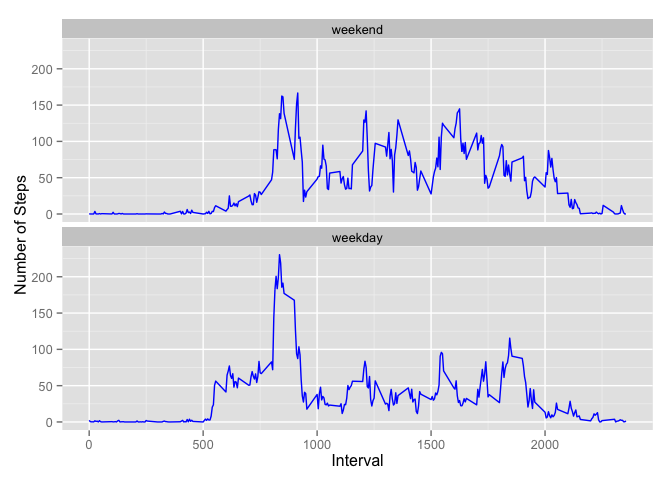

# Reproducible Research: Peer Assessment 1

## Loading necessary libraries

```r
library("dplyr")
library("knitr")
library("ggplot2")
library("DataCombine")
```

## Loading and preprocessing the data
1. Load the data (i.e. read.csv())
2. Process/transform the data (if necessary) into a format suitable for
analysis. The data (ie. steps) has been aggregated per date.

```r
activity<-read.csv("activity.csv")
activityNoNA<-subset(activity, steps!="NA")
sumstep<-aggregate(steps ~ date, data=activity, FUN=sum, na.action=na.omit)
```

## What is mean and median total number of steps taken per day?
1. Make a histogram of the total number of steps taken each day

```r
hist(sumstep$steps, xlab="Steps", main="Histogram of the Total Number of Steps Taken Each Day")
```

 

2. Calculate and report the mean and median total number of steps taken per day

```r
meanstep<-paste("Mean total number of steps taken per day: ", mean(sumstep$steps))
meanstep
```

```
## [1] "Mean total number of steps taken per day:  10766.1886792453"
```

```r
medianstep<-paste("Median total number of steps taken per day: ", median(sumstep$steps))
medianstep
```

```
## [1] "Median total number of steps taken per day:  10765"
```

## What is the average daily activity pattern?
1. Make a time series plot (i.e. type = "l") of the 5-minute interval (x-axis) and the average number of steps taken, averaged across all days (y-axis)

```r
x<-seq(from = 0, to = 2400, by = 100)
fiveminMean<-aggregate(steps ~ interval, data=activity, FUN=mean, na.action=na.omit)
plot(fiveminMean$interval, fiveminMean$steps, type="l", 
     main="Average Daily Activity", 
     ylab="Average no. of steps taken, averaged across all days",
     xlab="5-minute Interval",
     xaxt="n")
axis(1, at=x, las=2)
```

 

2. Which 5-minute interval, on average across all the days in the dataset, contains the maximum number of steps?

```r
pos<-which(fiveminMean == max(fiveminMean$steps), arr.ind = TRUE)
row<-pos[1,1]
fiveminMean[row,]
```

```
##     interval    steps
## 104      835 206.1698
```
## Imputing missing values
1. Calculate and report the total number of missing values in the dataset
(i.e. the total number of rows with NAs)

```r
nrow(activity)-nrow(activityNoNA)
```

```
## [1] 2304
```
2.Devise a strategy for filling in all of the missing values in the dataset. The strategy does not need to be sophisticated. For example, you could use the mean/median for that day, or the mean for that 5-minute interval, etc.

####Observation: Values are observed to be missing for all intervals for some dates. Hence, the strategy to fill in all the missing values is to use the mean for that 5-minute interval, eg. steps value for '10 min' interval will be filled in by the mean value of '10 min' interval.

3. Create a new dataset that is equal to the original dataset but with the missing data filled in (using the strategy as illustrated above)

```r
activityNA<-subset(activity, is.na(steps))
activityNA$steps<-fiveminMean$steps[match(fiveminMean$interval, activity$interval)]
activityfill<-rbind(activityNA, activityNoNA)      
```
4. Make a histogram of the total number of steps taken each day and Calculate and report the mean and median total number of steps taken per day. Do these values differ from the estimates from the first part of the assignment? What is the impact of imputing missing data on the estimates of the total daily number of steps?

```r
sumfill<-aggregate(steps ~ date, data=activityfill, FUN=sum, na.action=na.omit)

par(mfrow=c(1,2))
hist(sumstep$steps, xlab="Steps", main="Data Without Imputing")
hist(sumfill$steps, xlab="Steps", main="Data With Imputing")
```

 

####Observation: Steps in the block of 10,000 to 15,000 has higher frequency after imputing missing values using the stated strategy. 


```r
meanfill<-paste("Mean total number of steps taken per day after imputing: ", mean(sumfill$steps))
meanstep
```

```
## [1] "Mean total number of steps taken per day:  10766.1886792453"
```

```r
meanfill
```

```
## [1] "Mean total number of steps taken per day after imputing:  10766.1886792453"
```

```r
medianfill<-paste("Median total number of steps taken per day after imputing: ", median(sumfill$steps))
medianstep
```

```
## [1] "Median total number of steps taken per day:  10765"
```

```r
medianfill
```

```
## [1] "Median total number of steps taken per day after imputing:  10766.1886792453"
```
####Observation: No difference is observed for mean value, but median value after imputing missing value is higher.


```r
fiveminfillMean<-aggregate(steps ~ interval, data=activityfill, FUN=mean, na.action=na.omit)
posfill<-which(fiveminfillMean == max(fiveminfillMean$steps), arr.ind = TRUE)
row<-posfill[1,1]
fiveminfillMean[row,]
```

```
##     interval    steps
## 104      835 206.1698
```

####Observation: No change to the maximum number of steps.

## Are there differences in activity patterns between weekdays and weekends?
1. Create a new factor variable in the dataset with two levels – “weekday” and “weekend” indicating whether a given date is a weekday or weekend day.

```r
weekends<-c("Saturday", "Sunday")
activityfill$date<-as.Date(activityfill$date)
activityfill<-mutate(activityfill, daytype<-ifelse((weekdays(activityfill$date) %in% weekends), "weekend", "weekday"))

cnames<-c("steps", "date", "interval", "typeday")
colnames(activityfill)<-cnames
activityfill$typeday<-as.factor(activityfill$typeday)
```

2. Make a panel plot containing a time series plot (i.e. type = "l") of the 5-minute interval (x-axis) and the average number of steps taken, averaged across all weekday days or weekend days (y-axis). 

```r
fiveminfillMean<-aggregate(steps ~ interval+typeday, data=activityfill, FUN=mean, na.action=na.omit)

p<-ggplot(fiveminfillMean, aes(x=interval, y=steps))
p+geom_line(colour="blue")+facet_wrap(~typeday, nrow=2, as.table=F)+xlab("Interval")+ylab("Number of Steps")
```

 

####Observation: In weekends, the average number of steps taken for most of the intervals were above 50 steps comparing to weekday, which were lower except for a spike between interval 800 to 900.
